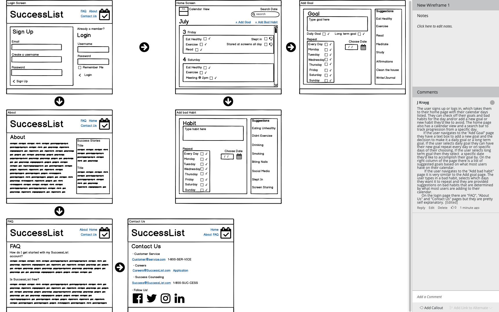

# successList
Success/Failure Checklist — You can set your goals that you want to accomplish daily and bad habits that you fall into. Then at the end of the day you go through a checklist to see your performance for that day and get scored. You can also go back and see previous days to see if you’ve been on track or have fallen back into bad habits. Maybe an overall score , like a bar that is green when you are sticking to your goals and avoiding your bad habits and then red when you’re not doing so well?, people like getting graded on things for some reason. Maybe a way to compare your checklist with others to keep each other motivated.

# UI
The user signs up or logs in, which takes them to their home page with their calendar days listed. They can check off their goals and bad habits for the day and/or add a new goal or new habit they'd like to avoid. The home page also has a calendar view and a search bar to track progression from a specific day. 
If the user navigates to the "Add Goal" page they have a text box to add a new goal and the decision to make it a daily goal or a long term goal. If the user checks daily goal they can have their new goal repeat every day or on specific days of their choosing. If the user checks long term goal they select a specific date they'd like to accomplish their goal by. On the right column of the page there is a list of suggested goals based on what most users have on their calendar.
If the user navigates to the "Add bad habit" page it is very similar to the Add goal page. The user types in a bad habit, selects which days they want it to repeat and they are provided suggestions on bad habits that are determined by what most users are adding to their calendar. 
On the login page there are "FAQ", "About Us" and "Contact Us" pages but they are pretty self explanatory.

